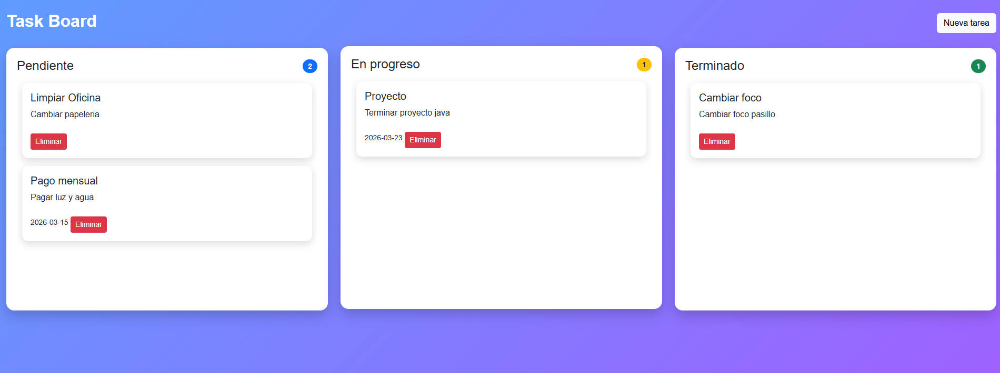

# 🗂️ Task Manager Kanban


Aplicación web tipo **Kanban Board** para gestionar tareas utilizando **Spring Boot**, **Thymeleaf** y **Bootstrap**.

Permite crear, mover y eliminar tareas mediante **Drag & Drop**, organizándolas en columnas según su estado.

---

## 📸 Vista de la aplicación



---

## ✨ Características

* 📋 Crear nuevas tareas
* 🧲 Mover tareas entre columnas con **Drag & Drop**
* 🗑️ Eliminar tareas
* 📊 Contador de tareas por columna
* 💾 Persistencia usando **H2 Database**
* 🎨 Interfaz moderna con **Bootstrap**

---

## 🧱 Tecnologías utilizadas

* **Java 17**
* **Spring Boot**
* **Spring MVC**
* **Spring Data JPA**
* **Thymeleaf**
* **Bootstrap 5**
* **H2 Database**
* **JavaScript (Drag & Drop API)**

---

## 📁 Estructura del proyecto

```
src
 ├─ controller
 │   └─ TaskController.java
 │
 ├─ model
 │   ├─ Task.java
 │   └─ Estado.java
 │
 ├─ repository
 │   └─ TaskRepository.java
 │
 ├─ service
 │   └─ TaskService.java
 │
 └─ resources
     ├─ templates
     │   └─ board.html
     ├─ static
     │   ├─ css
     │   │   └─ styles.css
     │   └─ js
     │       └─ board.js
```

---

## 🚀 Ejecutar el proyecto

### 1️⃣ Clonar el repositorio

```
git clone https://github.com/tuusuario/task-manager-kanban.git
```

### 2️⃣ Entrar al proyecto

```
cd task-manager-kanban
```

### 3️⃣ Ejecutar la aplicación

Desde tu IDE o con Maven:

```
./mvnw spring-boot:run
```

---

## 🌐 Acceder a la aplicación

```
http://localhost:8080/board
```

---

## 🗄️ Consola de base de datos

Spring Boot habilita la consola de **H2**:

```
http://localhost:8080/h2-console
```

Configuración:

```
JDBC URL: jdbc:h2:file:./data/taskdb
User: sa
Password: (vacío)
```

---

## 👨‍💻 Autor

Desarrollado como proyecto de práctica para aprender **Spring Boot y aplicaciones web interactivas**.
